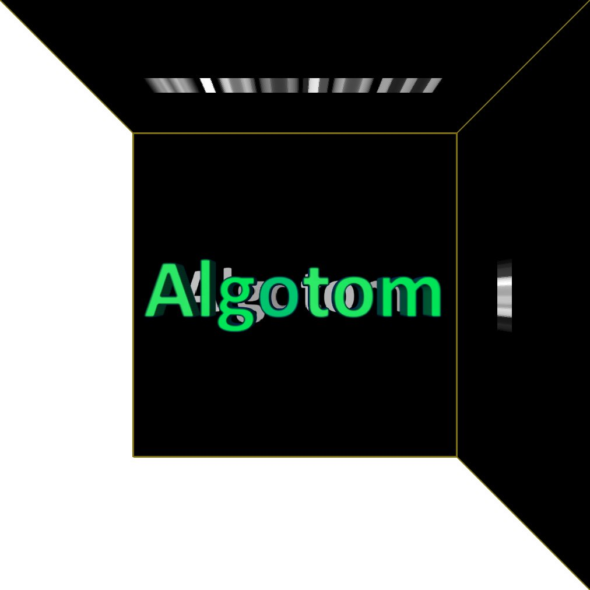

Data processing algorithms for tomography
=========================================

Welcome to Algotom's documentation about data processing algorithms for tomography.
This documentation is not only to explain functions available in the Algotom
package but also to present tomography-related tutorials, technical notes, and
applications.

Table of Contents
=================

.. toctree::
   :numbered:
   :maxdepth: 4

   toc/section1
   toc/section2
   toc/section3
   toc/section4
   toc/section5
   toc/section6
   toc/section7
   toc/section8

